<!-- HARSH CHOUDHARY · github.com/Harsha-108
     Visual system mirrors Portfolio.html.
     Section headers, hero, whoami panel, stats and footer are SVG assets
     in /assets/readme/. The live widgets (stars, streak, stats) keep
     their dynamic upstreams. -->

<!-- ─── HERO ─── -->

  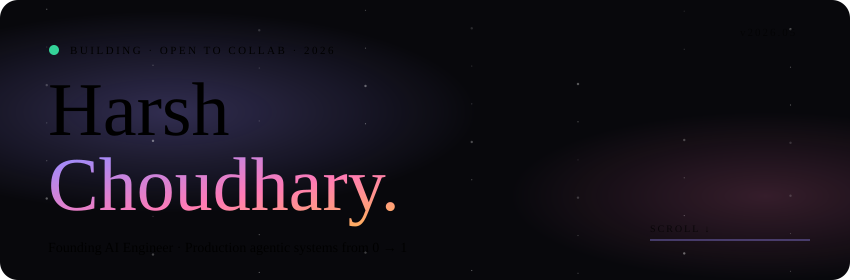

  &nbsp;
  &nbsp;
  &nbsp;
  &nbsp;
  

<!-- ─── MARQUEE (live, animated typing SVG) ─── -->

  

<!-- ─── 01 · ABOUT ─── -->

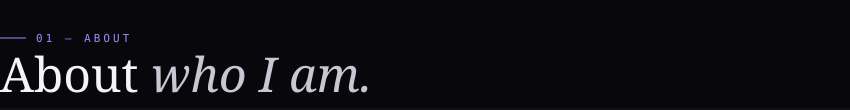

  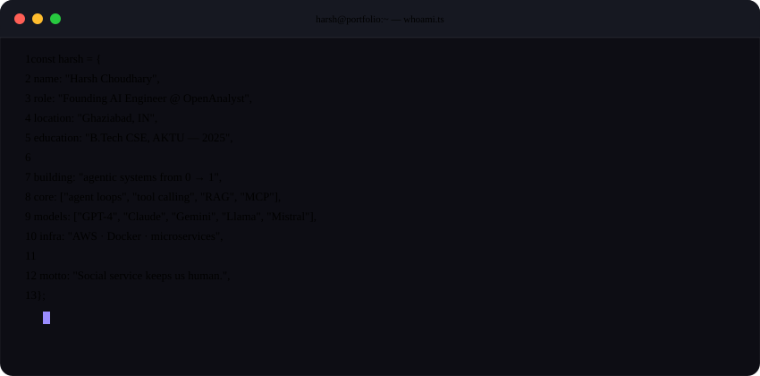

  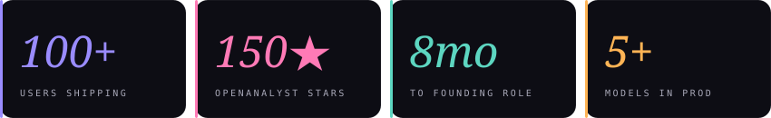

<!-- ─── 02 · WORK ─── -->

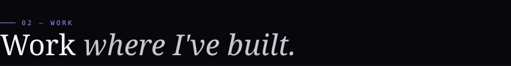

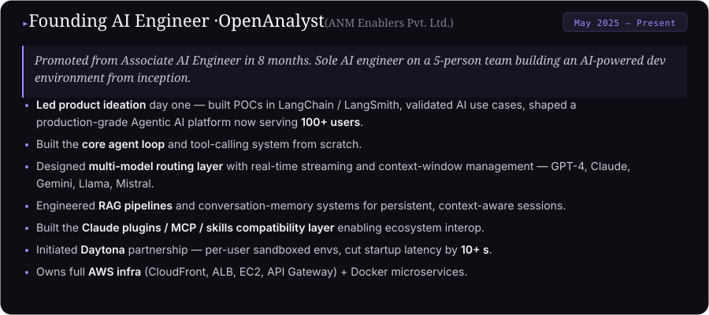

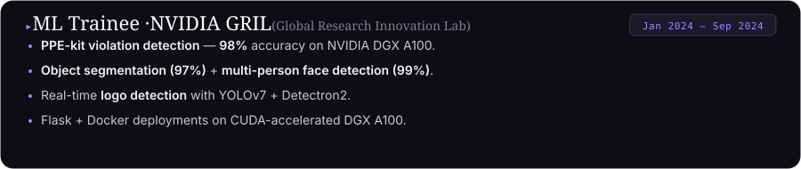

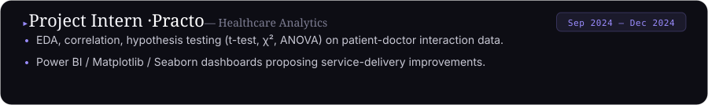

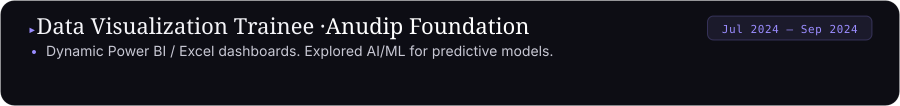

<!-- ─── 03 · PROJECTS ─── -->

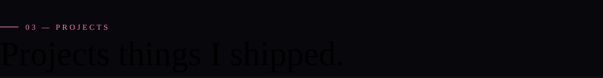

  <a href="https://github.com/OpenAnalystInc/OpenAnalyst">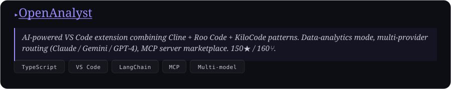</a>

  
  
  
  

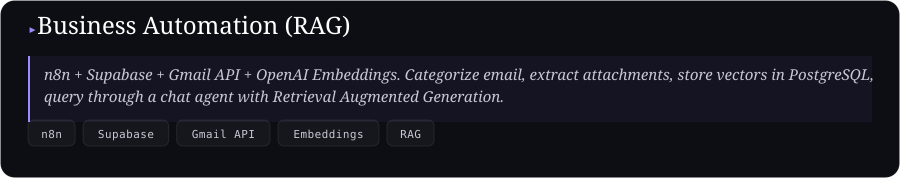

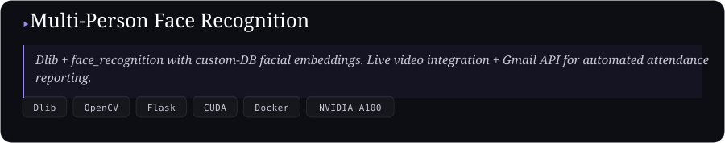

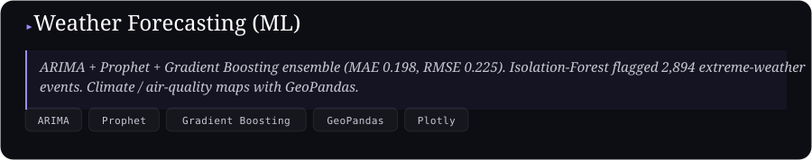

<!-- ─── 04 · STACK ─── -->

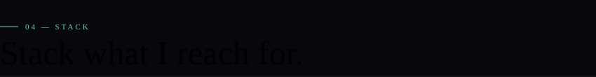

**GenAI · LLM**

  
  
  
  
  
  
  
  
  

**ML · NLP · CV**

  
  
  
  
  
  
  
  

**Cloud · Infra**

  
  
  
  

**Data · Viz**

  
  
  
  
  
  
  

**Languages**

  
  
  
  
  

<!-- ─── 05 · LIVE GITHUB ─── -->

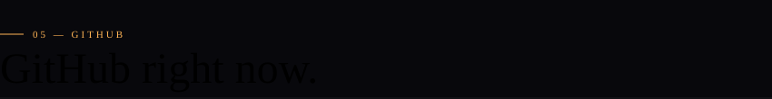

  
  

  

  

  

#### `▸` Latest activity &nbsp;*auto-updates via GitHub Action*

<!--START_SECTION:activity-->
1. 🎉 Merged a PR in `OpenAnalystInc/OpenAnalyst`
2. 🚀 Pushed to `main` in `OpenAnalystInc/OpenAnalyst`
3. ⭐ Starred a repo
4. 🐛 Opened an issue in `OpenAnalystInc/OpenAnalyst`
5. 💬 Commented on a discussion
<!--END_SECTION:activity-->

#### `▸` Speaking & Community

- 🎙 **"MCPs & Context Engineering"** — 1.5-hr session at **Bluecore**, 2025
- 🤝 **Core Team — Neev Shakti Sanstha** · community drives & social service

#### `▸` Awards & Certificates

| Award | Issuer | Year |
|---|---|---|
| **TCS Prime Qualifier** — cleared national-level screening | TCS | 2025 |
| Certified in **AI & Machine Learning** | NVIDIA GRIL | 2024 |
| Certified in **Data Visualization** | Anudip Foundation | 2024 |
| **Letter of Recognition** — Outstanding Contribution | Practo | 2024 |

<!-- ─── 06 · REACH ─── -->

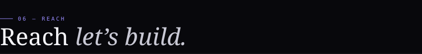

  &nbsp;
  &nbsp;
  

  

